# ENGENHARIA DE SOFTWARE

- [REPOSITORIO ENG. SE SW.](#repositorio-eng-se-sw)
- [1. Introdução](#1-introdução)
- [2. Problema e descrição do negócio.](#2-problema-e-descrição-do-negócio)
- [3. Visão geral do sistema](#3-visão-geral-do-sistema)
- [4. Diagrama ER](#4-diagrama-er)
- [5. Diagrama de classe](#5-diagrama-de-classe)
- [6. Casos de uso](#6-casos-de-uso)
  - [6.1 Histórias de Usuário](#61-histórias-de-usuário)
- [7. Diagrama de componente](#7-diagrama-de-componente)
- [8. Diagrama de implantação](#8-diagrama-de-implantação)
- [9. Protótipo de telas](#9-prototipo-de-telas)
- [10 Diagrama de navegação de telas](#10-diagrama-de-navegação-de-telas)
- [11. Pilha tecnológica](#11-pilha-tecnológica)
- [12. Requisitos do sistema](#12-requisitos-do-sistema)
- [13. Considerações sobre segurança](#13-considerações-sobre-segurança)
- [14. manutenção e instalação](#14-manutenção-e-instalação)
- [15. Glossário](#15-glossario)

# 1. Introdução
O projeto a seguir apresenta um sistema desenvolvido para um pet shop. A empresa é considerada  micro e iniciou as atividades recentemente. Ao possuir serviços exclusivos, os sistemas presentes no mercado não se enquadram, desta forma, os proprietários decidiram desenvolver uma solução própria. Esta solução é detalhada.

# 2. Problema e descrição do negócio.

Descrição do cenário onde o sistema deverá funcionar:
                                                                                

 1  ->  A clínica veterinária atende apenas os animais: gatos e cachorros.                         
 2  -> Os clientes devem fazer um cadastro de si e dos animais.                                   
 3  ->  Os clientes devem informar as condições nas quais os animais chegam.                       
 4  ->  Os clientes devem informar o tipo de ração que o animal come.                              
 5  ->  O cliente deve informar hábitos do animal.                                                 
 6  ->  Para cada animal é possível que mais de um veterinário o atenda.                           
 7  ->  Os animais podem chegar e serem atendidos de acordo com uma agenda do dia.                 
 8  ->  Cada animal atendido receberá uma ficha e um prontuário.                                   
 9  ->  Outros donos podem querer marcar horários de atendimento futuro.                           
 10 ->  O atendimento gera uma receita para o animal.                                              
 11 ->  Quando um cliente chega na clínica veterinária ele é atendido por um atendente.            
 12 ->  O atendente deve verificar se existe agenda disponível com um veterinário.                 
 13 ->  O atendente deve colocar o cliente e seu animal na fila de espera, se for o caso.          
 14 ->  O atendente deve levar o cliente e o animal até o veterinário.                             
 15 ->  O veterinário deve realizar uma entrevista com o dono do animal.                           
 16 ->  O resultado da entrevista deve ir para um formulário.                                      
 17 ->  O veterinário deverá examinar o animal e anotar em prontuário (ficha) suas observações.    
 18 ->  Dependendo da situação do animal, este receberá uma receita.   
 19 ->  O dono do animal deve informar se o mesmo possui alergia a alguma medicação.  
 20 ->  Registrar o diagnóstico e criar um plano de tratamento, incluindo prescrições e recomendações.                           
 21 ->  Registrar os medicamentos prescritos e o plano de administração.                                      
 22 ->  Programar e registrar consultas de acompanhamento para monitorar a evolução do tratamento.    
 23 ->  Criar faturas detalhadas para os serviços prestados, incluindo consultas, exames e tratamentos.   
 24 ->  Registrar pagamentos e atualizar o status financeiro no sistema.

# 3. Visão geral do sistema

# 4. Diagrama ER

```mermaid
erDiagram
    CLIENTS {
        string id PK "ID do Cliente"
        string name "Nome do Cliente"
        string contact "Contato do Cliente"
    }
    ANIMALS {
        string id PK "ID do Animal"
        string name "Nome do Animal"
        string type "Tipo (Gato/Cachorro)"
        string condition "Condição ao Chegar"
        string foodType "Tipo de Ração"
        string habits "Hábitos"
    }
    VETERINARIANS {
        string id PK "ID do Veterinário"
        string name "Nome do Veterinário"
        string specialty "Especialidade"
    }
    APPOINTMENTS {
        string id PK "ID do Atendimento"
        date date "Data do Atendimento"
        string time "Hora do Atendimento"
        string status "Status (Agendado/Realizado)"
    }
    RECORDS {
        string id PK "ID do Prontuário"
        string animalId FK "ID do Animal"
        string vetId FK "ID do Veterinário"
        string observations "Observações"
        string diagnosis "Diagnóstico"
        string treatmentPlan "Plano de Tratamento"
        string prescription "Prescrições"
        string followUp "Consultas de Acompanhamento"
    }
    BILLS {
        string id PK "ID da Fatura"
        string appointmentId FK "ID do Atendimento"
        float amount "Valor"
        string status "Status do Pagamento"
    }
    ATTENDANTS {
        string id PK "ID do Atendente"
        string name "Nome do Atendente"
    }
    
    CLIENTS ||--o{ ANIMALS : owns
    ANIMALS ||--o{ APPOINTMENTS : "receives"
    VETERINARIANS ||--o{ APPOINTMENTS : "conducts"
    APPOINTMENTS ||--o{ RECORDS : "generates"
    RECORDS ||--o{ BILLS : "bills"
    ATTENDANTS ||--o{ APPOINTMENTS : "manages"
```

# 5. Diagrama de classe

# 6. Casos de uso

## 6.1 Histórias de Usuário

# 7. Diagrama de componente  

# 8. Diagrama de implantação

# 9. Protótipo de telas

# 10 Diagrama de navegação de telas

# 11. Pilha tecnológica

# 12. Requisitos do sistema

# 13. Considerações sobre segurança

# 14. manutenção e instalação

# 15. Glossário
