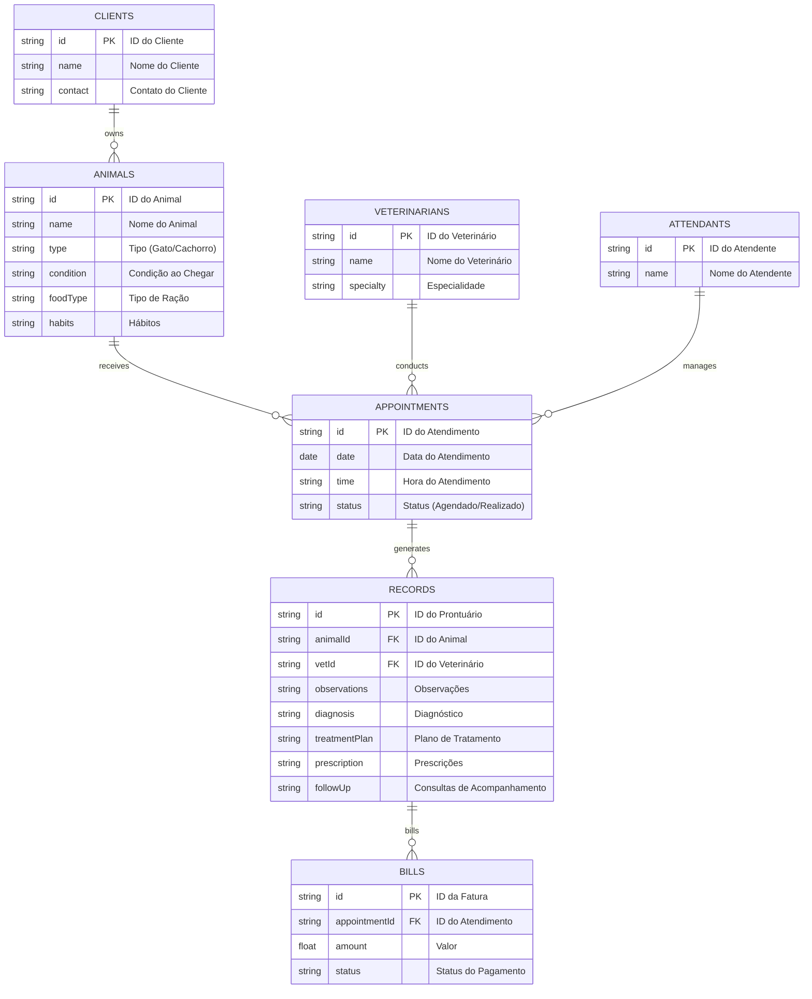
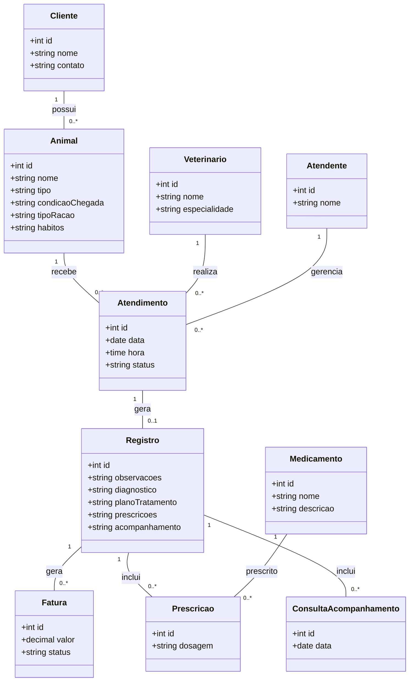
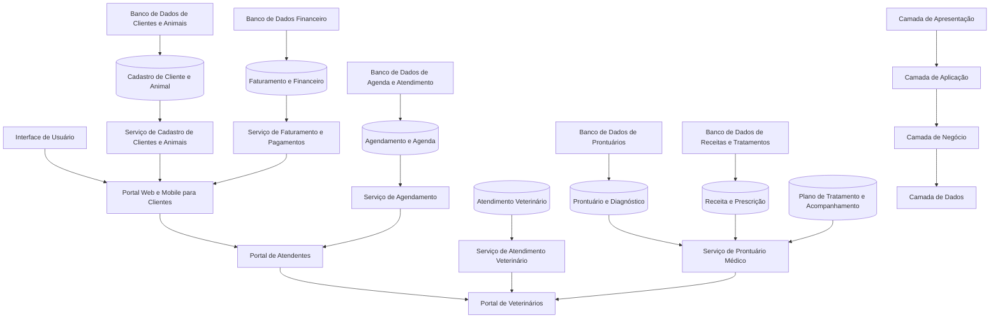

# REPOSITÓRIO - ENGENHARIA DE SOFTWARE


- [REPOSITORIO ENG. SE SW.](#repositorio-eng-se-sw)
- [1. Introdução](#1-introdução)
- [2. Problema e descrição do negócio.](#2-problema-e-descrição-do-negócio)
- [3. Visão geral do sistema](#3-visão-geral-do-sistema)
- [4. Diagrama ER](#4-diagrama-er)
- [5. Diagrama de classe](#5-diagrama-de-classe)
- [6. Casos de uso](#6-casos-de-uso)
  - [6.1 Histórias de Usuário](#61-histórias-de-usuário)
- [7. Diagrama de componente](#7-diagrama-de-componente)
- [8. Diagrama de implantação](#8-diagrama-de-implantação)
- [9. Protótipo de telas](#9-prototipo-de-telas)
- [10 Diagrama de navegação de telas](#10-diagrama-de-navegação-de-telas)
- [11. Pilha tecnológica](#11-pilha-tecnológica)
- [12. Requisitos do sistema](#12-requisitos-do-sistema)
- [13. Considerações sobre segurança](#13-considerações-sobre-segurança)
- [14. manutenção e instalação](#14-manutenção-e-instalação)
- [15. Glossário](#15-glossario)
- [16. SQL](#16-sql)
    - [16.1 script SQL para MYSQL para gerar as tabelas para as regras de negócio](#161-histórias-de-usuário)
    - [16.1 SQL comandos INSERT com dados fictícios para as tabelas](#161-histórias-de-usuário)

# 1. Introdução
O projeto a seguir apresenta um sistema desenvolvido para um pet shop. A empresa é considerada  micro e iniciou as atividades recentemente. Ao possuir serviços exclusivos, os sistemas presentes no mercado não se enquadram, desta forma, os proprietários decidiram desenvolver uma solução própria. Esta solução é detalhada.

# 2. Problema e descrição do negócio.

Descrição do cenário onde o sistema deverá funcionar:
                                                                                

 1  ->  A clínica veterinária atende apenas os animais: gatos e cachorros.                         
 2  -> Os clientes devem fazer um cadastro de si e dos animais.                                   
 3  ->  Os clientes devem informar as condições nas quais os animais chegam.                       
 4  ->  Os clientes devem informar o tipo de ração que o animal come.                              
 5  ->  O cliente deve informar hábitos do animal.                                                 
 6  ->  Para cada animal é possível que mais de um veterinário o atenda.                           
 7  ->  Os animais podem chegar e serem atendidos de acordo com uma agenda do dia.                 
 8  ->  Cada animal atendido receberá uma ficha e um prontuário.                                   
 9  ->  Outros donos podem querer marcar horários de atendimento futuro.                           
 10 ->  O atendimento gera uma receita para o animal.                                              
 11 ->  Quando um cliente chega na clínica veterinária ele é atendido por um atendente.            
 12 ->  O atendente deve verificar se existe agenda disponível com um veterinário.                 
 13 ->  O atendente deve colocar o cliente e seu animal na fila de espera, se for o caso.          
 14 ->  O atendente deve levar o cliente e o animal até o veterinário.                             
 15 ->  O veterinário deve realizar uma entrevista com o dono do animal.                           
 16 ->  O resultado da entrevista deve ir para um formulário.                                      
 17 ->  O veterinário deverá examinar o animal e anotar em prontuário (ficha) suas observações.    
 18 ->  Dependendo da situação do animal, este receberá uma receita.   
 19 ->  O dono do animal deve informar se o mesmo possui alergia a alguma medicação.  
 20 ->  Registrar o diagnóstico e criar um plano de tratamento, incluindo prescrições e recomendações.                           
 21 ->  Registrar os medicamentos prescritos e o plano de administração.                                      
 22 ->  Programar e registrar consultas de acompanhamento para monitorar a evolução do tratamento.    
 23 ->  Criar faturas detalhadas para os serviços prestados, incluindo consultas, exames e tratamentos.   
 24 ->  Registrar pagamentos e atualizar o status financeiro no sistema.


# 3. Visão geral do sistema

# 4. Diagrama ER




# 5. Diagrama de classe



# 6. Casos de uso

    

## 6.1 Histórias de Usuário

 ```

    1 - Cadastro de Cliente e Animal
        Como um cliente, quero me cadastrar e registrar meus animais (gato ou cachorro) no sistema, para que eu possa agendar consultas e receber atendimento adequado.

    2 - Informação sobre a Condição do Animal
        Como cliente, quero informar a condição em que meu animal chega à clínica, para que o veterinário tenha uma visão clara do estado de saúde inicial dele.

    2- Registro de Alimentação e Hábitos
        Como cliente, quero informar o tipo de ração que meu animal consome e seus hábitos (alimentação, comportamento), para que o veterinário possa ajustar recomendações conforme as necessidades do animal.

    3 - Marcar Consulta
        Como cliente, quero poder marcar horários de atendimento para meu animal, para garantir que ele seja atendido no momento mais conveniente e adequado.

    4 - Recebimento de Receita
        Como dono de animal, quero receber uma receita com as medicações e tratamentos recomendados após a consulta, para seguir o plano de tratamento do veterinário.

    5 - Fila de Espera e Acompanhamento
        Como atendente, quero verificar se há disponibilidade na agenda e, se não houver, colocar o cliente e seu animal na fila de espera para otimizar o fluxo de atendimentos.

    6 - Entrevista Inicial pelo Veterinário
        Como veterinário, quero realizar uma entrevista com o dono do animal antes do exame físico, para coletar informações essenciais sobre a saúde e os hábitos do animal.

    7 - Prontuário Completo
        Como veterinário, quero criar um prontuário completo para cada animal atendido, registrando todas as observações, diagnósticos e prescrições, para manter um histórico detalhado da saúde do animal.

    8 - Registro de Alergias e Medicações
        Como cliente, quero informar se meu animal tem alguma alergia a medicações, para que o veterinário possa evitar prescrever remédios que possam causar reações adversas.

    9 - Pagamento e Fatura
        Como cliente, quero receber uma fatura detalhada dos serviços prestados (consultas, exames e tratamentos) e efetuar o pagamento na clínica, garantindo que o status financeiro seja atualizado no sistema.

```

# 7. Diagrama de componente  

 

# 8. Diagrama de implantação


# 9. Protótipo de telas

## 9.1. Tela de Login


## 9.2. Tela de Cadastro


## 9.3. Tela de Grafico


## 9.4. Tela de Dashboard


# 10 Diagrama de navegação de telas


# 11. Pilha tecnológica



# 12. Requisitos do sistema

```
1. Servidores
Servidor de Aplicação

Configuração do Servidor de Aplicação:
CPU: Mínimo de 4 núcleos (preferível 8 para suportar escalabilidade).
Memória RAM: Mínimo de 16 GB.
Armazenamento: SSD de 500 GB, com opções de expansão conforme crescimento de dados.
Sistema Operacional: Linux (Ubuntu Server ou CentOS) ou Windows Server, dependendo da compatibilidade com a stack de desenvolvimento.
Software de Servidor de Aplicação:
Para aplicações em PHP: Apache ou Nginx.
Para Node.js: Servidor integrado ou configuração com Nginx como proxy reverso.
Alternativas para frameworks como Spring Boot (Java) ou Django (Python) também podem ser consideradas.
Servidor de Banco de Dados

Configuração do Servidor de Banco de Dados:
CPU: Mínimo de 4 núcleos, preferível 8 para operações intensivas.
Memória RAM: 32 GB para otimização de consultas e cache.
Armazenamento: SSD de 1 TB, com opções de expansão para backup e histórico de dados.
Sistema Operacional: Linux (Ubuntu Server ou CentOS).
Software de Banco de Dados: MySQL, PostgreSQL ou MongoDB, dependendo da escolha do banco de dados.
Replicação e Backup: Configurar replicação e backups automáticos diários para garantir disponibilidade e recuperação de dados.
Servidor de Backup e Recuperação de Desastres

Configuração do Servidor de Backup:
CPU: 2 núcleos.
Memória RAM: 8 GB.
Armazenamento: Mínimo de 2 TB em discos SATA ou SSD, dependendo do volume de dados e frequência de backup.
Sistema Operacional: Linux.
Software de Backup: Ferramentas como Bacula, Rsync, ou soluções de backup em nuvem, como AWS Backup, para gerenciamento e automação de backups.

2. Máquinas para Usuários (Atendentes e Veterinários)
Desktops para Atendentes:
CPU: Dual-core.
Memória RAM: 8 GB.
Armazenamento: SSD de 256 GB.
Sistema Operacional: Windows 10, Windows 11 ou Ubuntu Linux.
Navegador: Chrome, Firefox ou navegador compatível com o sistema.
Periféricos: Monitor de 21 polegadas, teclado e mouse.
Tablets para Veterinários (opcional):
Modelo sugerido: iPad com iPadOS ou tablets Android de qualidade similar.
Especificações:
Memória RAM: Mínimo de 4 GB.
Armazenamento: 64 GB ou superior.
Tela: 10 polegadas ou superior, para visualização de prontuários e registros.

3. Dispositivos de Rede e Segurança
Roteador Corporativo de Alta Capacidade:
Velocidade: Suporte para no mínimo 1 Gbps.
Capacidade: Múltiplas redes VLAN para segmentar o tráfego entre rede administrativa e rede pública para clientes.
Segurança: Controle de acesso (ACL), firewalls integrados, VPN para acesso seguro externo.
Switch Gerenciável (para conexões locais):
Portas: 24 portas (expansível), Gigabit Ethernet.
Gerenciamento: Switch gerenciável para configurar VLANs e segmentação de rede.
Marca sugerida: Cisco, HP ou Ubiquiti.
Firewall Dedicado:
Capacidade: Suporte para filtragem de tráfego de entrada e saída, prevenção contra intrusões (IPS) e detecção de ameaças.
Configuração: ACLs para restringir acesso e VPN para funcionários que necessitem acessar remotamente.
Marca sugerida: Fortinet, pfSense, SonicWall ou similar.
Access Points para Conexão Wi-Fi:
Cobertura: Implementar múltiplos pontos de acesso para cobrir áreas de atendimento e recepção.
Capacidade de Conexão Simultânea: Até 50 dispositivos.
Segurança Wi-Fi: WPA3 para maior segurança nas conexões.
Servidor de VPN (para acesso remoto seguro):
Configuração: Servidor de VPN integrado ou separado, com suporte a protocolos de segurança como OpenVPN ou IPSec.
Função: Permitir que veterinários e gestores acessem o sistema de forma segura fora das dependências da clínica.

4. Software e Licenciamento
Sistema Operacional Servidores:
Licenças necessárias: Windows Server, Ubuntu Server ou CentOS.
Firewall e VPN: Configuração de iptables (Linux) ou firewall dedicado com licenciamento (pfSense, Fortinet).
Ferramentas de Desenvolvimento e Deployment:
IDE: Visual Studio Code, IntelliJ, ou IDE preferida.
Sistema de Versionamento: Git (GitHub, GitLab ou Bitbucket para colaboração).
Pipeline de CI/CD: Jenkins, GitLab CI ou equivalente, para automação de build e deploy.
Software de Backup e Monitoramento:
Backup: Licença para AWS Backup, Bacula ou Rsync para backups locais.
Monitoramento: Zabbix, Grafana, ou Nagios para monitoramento da saúde do sistema.
Banco de Dados:
Licença de Banco de Dados: MySQL Community (gratuito) ou PostgreSQL, com planos de considerar versões empresariais caso o uso escale.

```

# 13. Considerações sobre segurança

 - Autenticação e Controle de Acesso
Parâmetros de Senha Seguros:
Comprimento mínimo de senha: No mínimo 12 caracteres.
Complexidade: Exigir ao menos uma letra maiúscula, uma minúscula, um número e um caractere especial.
Expiração de senha: Forçar redefinição de senha a cada 90 dias para usuários administrativos (como atendentes e veterinários).
Bloqueio de conta: Bloquear a conta após 5 tentativas de login falhas para prevenir ataques de força bruta.
Autenticação Multifator (MFA): Implementar MFA para todos os usuários administrativos, exigindo uma segunda forma de verificação (como um código enviado por SMS ou um app autenticador).
Controle de Acesso Baseado em Funções (RBAC):
Mínimo de Privilégios: Garantir que cada usuário tenha acesso apenas aos dados e funções necessárias ao seu papel (clientes, atendentes e veterinários).
Segregação de Funções: Dividir o acesso e os privilégios para prevenir que um único usuário possa realizar ações que comprometam a segurança do sistema.

 - Proteção contra Ataques
Proteção contra Ataques de Injeção SQL e XSS:
Sanitização de Entrada: Limpar e validar todos os dados de entrada do usuário para prevenir injeções SQL e ataques XSS.
Parâmetros Preparados: Usar parâmetros preparados em consultas SQL para evitar injeção de código malicioso.
Bibliotecas de Segurança: Utilizar bibliotecas de segurança específicas para evitar XSS em frameworks JavaScript.
Firewall e Sistema de Prevenção de Intrusões (IPS):
Firewall de Aplicação Web (WAF): Instalar um WAF para monitorar e bloquear tráfego malicioso (como OWASP ModSecurity Core Rule Set).
Sistema de Prevenção de Intrusões (IPS): Configurar um IPS para detectar e bloquear tentativas de acesso não autorizadas.
Proteção contra Ataques de Força Bruta:
Limitação de Taxa: Limitar o número de tentativas de login por usuário/IP em um determinado período.
Recaptcha ou hCaptcha: Implementar um CAPTCHA no formulário de login para bloquear bots automatizados.

 - Criptografia de Dados
Criptografia de Dados em Trânsito:
HTTPS com TLS: Exigir HTTPS em todas as conexões, utilizando TLS 1.2 ou superior para proteger os dados transmitidos entre cliente e servidor.
Certificados SSL/TLS: Usar certificados de uma autoridade confiável e configurá-los com boas práticas de segurança (como Perfect Forward Secrecy).
Criptografia de Dados em Repouso:
Criptografia no Banco de Dados: Criptografar campos sensíveis (como dados pessoais e informações financeiras) no banco de dados utilizando AES-256.
Armazenamento Seguro de Senhas: Usar algoritmos de hashing seguros como bcrypt ou Argon2 para armazenar senhas, com um número suficiente de iterações para resistir a ataques de força bruta.

 - Monitoramento e Auditoria
Monitoramento Contínuo de Segurança:
Ferramenta de Monitoramento (SIEM): Implementar um sistema de monitoramento e correlação de eventos (SIEM) como Splunk, ELK Stack, ou Wazuh para monitorar logs de atividade e detectar comportamentos suspeitos.
Alertas de Segurança: Configurar alertas para atividades incomuns, como acessos fora do horário padrão, tentativas de login falhas e acessos de locais desconhecidos.
Auditoria e Log de Acesso:
Logs de Auditoria: Registrar todas as atividades dos usuários administrativos e as ações relacionadas a dados sensíveis, incluindo login, logout, visualização de prontuários e edição de dados.
Armazenamento Seguro de Logs: Proteger os logs de auditoria contra modificações e garantir que eles sejam armazenados em local seguro e com criptografia.
Revisão Periódica de Logs: Realizar revisões regulares dos logs de auditoria para identificar e corrigir comportamentos suspeitos ou anômalos.

 - Backup e Recuperação
Política de Backup Seguro:
Backup Regular: Realizar backups diários e semanais de todos os dados críticos (banco de dados, logs e configurações do sistema).
Criptografia de Backups: Armazenar backups com criptografia AES-256 para proteger dados em caso de perda ou roubo de mídia.
Armazenamento Offline: Manter uma cópia dos backups em um local offline para prevenção contra ransomware.
Testes de Recuperação de Backup:
Testes Regulares de Recuperação: Realizar testes de restauração de backups regularmente para garantir que o processo de recuperação funcione conforme o planejado.
Plano de Recuperação de Desastres (DRP): Desenvolver e documentar um DRP para restaurar o sistema com o menor tempo de inatividade possível após uma falha.

 - Segurança de Dispositivos e Conexões
Dispositivos de Usuários (Computadores e Tablets):
Antivírus e Antimalware: Instalar soluções de antivírus e antimalware em todos os dispositivos de atendentes e veterinários.
Bloqueio de Tela Automático: Configurar um bloqueio automático para proteger dispositivos que permanecem inativos por alguns minutos.
Acesso via VPN: Exigir o uso de uma VPN para todos os acessos ao sistema por dispositivos fora da rede da clínica.
Segurança de Rede:
Segmentação de Rede: Separar a rede administrativa da rede pública para evitar o acesso não autorizado aos sistemas críticos.
Proteção contra Ataques DDoS: Usar uma solução de mitigação de DDoS, especialmente para sistemas públicos, para proteger contra ataques de negação de serviço.
Autenticação de Wi-Fi Segura: Configurar redes Wi-Fi com WPA3 e restringir o acesso à rede administrativa.

 - Boas Práticas de Gerenciamento de Vulnerabilidades
Atualização e Patching Regular:
Patches de Segurança: Manter todos os softwares atualizados com as versões mais recentes e corrigidas para eliminar vulnerabilidades.
Verificações de Vulnerabilidades: Realizar varreduras de segurança periodicamente para identificar e corrigir vulnerabilidades de segurança em servidores e dispositivos de rede.
Teste de Segurança Regular:
Testes de Penetração (Pentest): Realizar testes de penetração anualmente ou após grandes atualizações para identificar possíveis vulnerabilidades exploráveis.
Testes de Intrusão Internos: Simular ataques internos para avaliar a resistência do sistema a funcionários mal-intencionados ou compromissos internos.

# 14. manutenção e instalação

# 15. Glossário

# 16. Script SQL

  ## 16.1 crie um scrit sql para MYSQL para gerar as tabelas para as regras de negócio.

  ```SQL
  -- Tabela de Clientes
CREATE TABLE Clientes (
    id INT AUTO_INCREMENT PRIMARY KEY,
    nome VARCHAR(255) NOT NULL,
    contato VARCHAR(255) NOT NULL
);

-- Tabela de Animais
CREATE TABLE Animais (
    id INT AUTO_INCREMENT PRIMARY KEY,
    nome VARCHAR(255) NOT NULL,
    tipo ENUM('Gato', 'Cachorro') NOT NULL,
    condicao_chegada TEXT,
    tipo_racao VARCHAR(255),
    habitos TEXT,
    cliente_id INT,
    FOREIGN KEY (cliente_id) REFERENCES Clientes(id)
);

-- Tabela de Veterinários
CREATE TABLE Veterinarios (
    id INT AUTO_INCREMENT PRIMARY KEY,
    nome VARCHAR(255) NOT NULL,
    especialidade VARCHAR(255)
);

-- Tabela de Atendimentos
CREATE TABLE Atendimentos (
    id INT AUTO_INCREMENT PRIMARY KEY,
    data DATE NOT NULL,
    hora TIME NOT NULL,
    status ENUM('Agendado', 'Realizado') NOT NULL,
    animal_id INT,
    atendente_id INT,
    FOREIGN KEY (animal_id) REFERENCES Animais(id)
);

-- Tabela de Registros (Prontuário)
CREATE TABLE Registros (
    id INT AUTO_INCREMENT PRIMARY KEY,
    animal_id INT,
    veterinario_id INT,
    observacoes TEXT,
    diagnostico TEXT,
    plano_tratamento TEXT,
    prescricoes TEXT,
    acompanhamento TEXT,
    FOREIGN KEY (animal_id) REFERENCES Animais(id),
    FOREIGN KEY (veterinario_id) REFERENCES Veterinarios(id)
);

-- Tabela de Faturas
CREATE TABLE Faturas (
    id INT AUTO_INCREMENT PRIMARY KEY,
    atendimento_id INT,
    valor DECIMAL(10, 2) NOT NULL,
    status ENUM('Pendente', 'Pago') NOT NULL,
    FOREIGN KEY (atendimento_id) REFERENCES Atendimentos(id)
);

-- Tabela de Atendentes
CREATE TABLE Atendentes (
    id INT AUTO_INCREMENT PRIMARY KEY,
    nome VARCHAR(255) NOT NULL
);

-- Tabela de Medicamentos
CREATE TABLE Medicamentos (
    id INT AUTO_INCREMENT PRIMARY KEY,
    nome VARCHAR(255) NOT NULL,
    descricao TEXT
);

-- Tabela de Prescrições
CREATE TABLE Prescricoes (
    id INT AUTO_INCREMENT PRIMARY KEY,
    registro_id INT,
    medicamento_id INT,
    dosagem VARCHAR(255),
    FOREIGN KEY (registro_id) REFERENCES Registros(id),
    FOREIGN KEY (medicamento_id) REFERENCES Medicamentos(id)
);

-- Tabela de Consultas de Acompanhamento
CREATE TABLE ConsultasAcompanhamento (
    id INT AUTO_INCREMENT PRIMARY KEY,
    registro_id INT,
    data DATE NOT NULL,
    FOREIGN KEY (registro_id) REFERENCES Registros(id)
);
```

  ## 16.2 gere em SQL comandos INSERT com dados fictícios para as tabelas.

  ```SQL
-- Inserir dados na tabela Clientes
INSERT INTO Clientes (nome, contato) VALUES
('Maria Silva', 'maria.silva@example.com'),
('João Santos', 'joao.santos@example.com'),
('Ana Oliveira', 'ana.oliveira@example.com');

-- Inserir dados na tabela Animais
INSERT INTO Animais (nome, tipo, condicao_chegada, tipo_racao, habitos, cliente_id) VALUES
('Felix', 'Gato', 'Fraco, desidratado', 'Ração seca', 'Dormir muito', 1),
('Rex', 'Cachorro', 'Lesão na pata', 'Ração úmida', 'Brincar com bolas', 2),
('Luna', 'Gato', 'Saudável', 'Ração seca', 'Caçar brinquedos', 3);

-- Inserir dados na tabela Veterinarios
INSERT INTO Veterinarios (nome, especialidade) VALUES
('Dr. Carlos Almeida', 'Dermatologia'),
('Dra. Fernanda Costa', 'Cardiologia'),
('Dr. Paulo Mendes', 'Ortopedia');

-- Inserir dados na tabela Atendimentos
INSERT INTO Atendimentos (data, hora, status, animal_id, atendente_id) VALUES
('2024-09-20', '09:00:00', 'Agendado', 1, 1),
('2024-09-20', '10:00:00', 'Agendado', 2, 2),
('2024-09-21', '11:00:00', 'Realizado', 3, 3);

-- Inserir dados na tabela Registros
INSERT INTO Registros (animal_id, veterinario_id, observacoes, diagnostico, plano_tratamento, prescricoes, acompanhamento) VALUES
(1, 1, 'Pelagem opaca, sinais de desidratação.', 'Desidratação', 'Hidratação intravenosa, dieta equilibrada.', 'Solução salina', 'Reavaliação em 1 semana.'),
(2, 3, 'Lesão visível na pata direita.', 'Fratura na pata', 'Imobilização com gesso, analgésicos.', 'Analgesia e anti-inflamatório', 'Revisão em 10 dias.'),
(3, 2, 'Animais saudáveis, sem sinais de doença.', 'Saudável', 'Manutenção dos cuidados gerais.', NULL, 'Reavaliação anual.');

-- Inserir dados na tabela Faturas
INSERT INTO Faturas (atendimento_id, valor, status) VALUES
(1, 150.00, 'Pendente'),
(2, 200.00, 'Pago'),
(3, 100.00, 'Pendente');

-- Inserir dados na tabela Atendentes
INSERT INTO Atendentes (nome) VALUES
('Joana Pereira'),
('Ricardo Lima'),
('Patrícia Souza');

```


